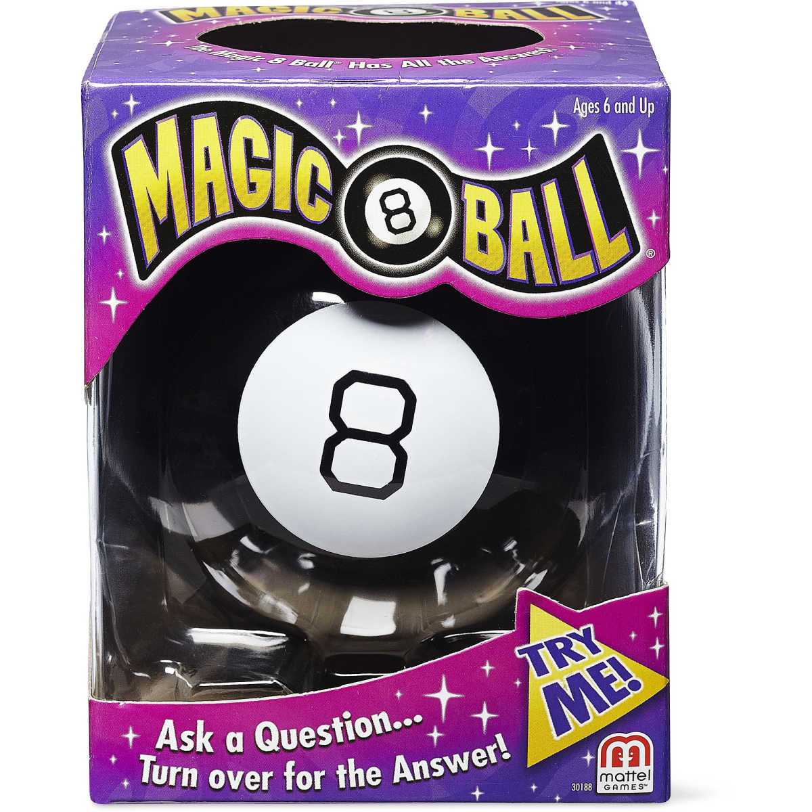

# Rigetti Magic 8 Ball

# Introduction to Quantum Computing

This example highlights in a simple way how we can employ and deploy the Quantum Simulation Code from Rigetti to have some fun and create a magic 8 ball. You might seen them, there is a photo below, its a sphere that resembles the black 8 ball in pool. Shaking the ball, randomizes and highlights one of the surfaces (typically 20) with some text on it. The use case is to crack the stalemate when making decisions. Here we will use the quantum equivalent of shaking to perform the randomization.  

# How it works

Create a number of qubits, the exact number of qubits will be dependent upon the number of options. Here we show the canonical existence of a 20 sided Magic 8 Ball. 

Takes advantage of the Quantum superposition which means that we can cannot know what state a qubit is in until we measure it. We have two possible measurement results for each qubit. 

# Qubits

A qubit is somewhat akin to the quantum equivalent of a bit, but it can exist in a mixed state, a superposition of two states. We thus put a series of qubits into a superposition that according to the Born rule has equal probability of being in state |0> and state |1>. We can perform this very easily by taking an initial state |0> into a|0> + b|1> with a transformation called the Hadamard or H in the pyquil toolset.

